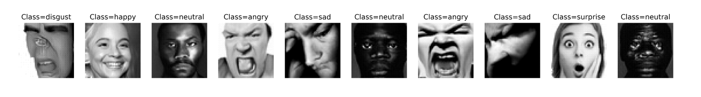

# Diffusion Model using Transformer

Pytorch implemention of DiT 

## Conditional generation from FER2013 dataset



## References
- [Denoising Diffusion Probabilistic Models (Ho et al., 2020)](https://arxiv.org/abs/2006.11239)
- [DiT: Diffusion Transformers (Peebles & Xie, 2022)](https://arxiv.org/abs/2212.09748)
## Training

```
usage: python train.py [-h] [-t TRAIN_DIRECTORY] [-e EPOCHS] [-d DEVICE]
                [-b BATCH_SIZE] [-w WORKERS] [-c CONDITIONAL]

options:
  -h, --help            show this help message and exit
  -t, --train_directory TRAIN_DIRECTORY
                        path to train directory
  -e, --epochs EPOCHS   path to train directory
  -d, --device DEVICE
  -b, --batch_size BATCH_SIZE
  -w, --workers WORKERS
  -c, --conditional CONDITIONAL
```

## Sampling

```
usage: python generate.py [-h] [-o OUTPUT] [-n NUM_IMAGES]

options:
  -h, --help            show this help message and exit
  -o, --output OUTPUT   output directory
  -n, --num_images NUM_IMAGES
```

